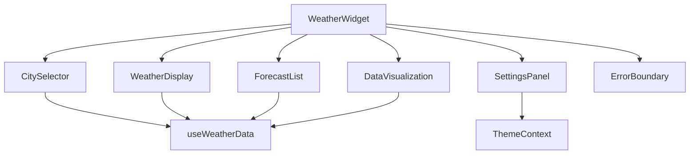
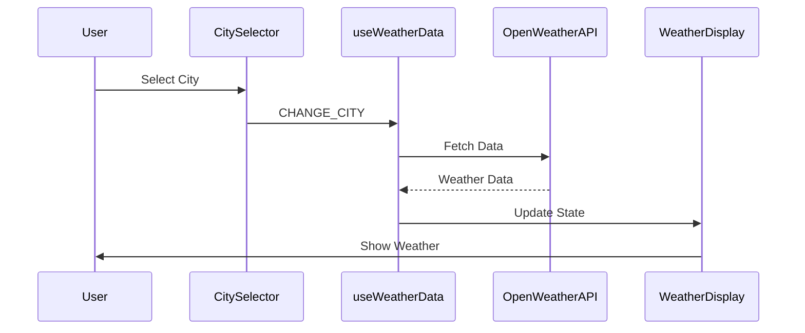

# Weather Dashboard Widget - Technical Assessment

## 📅 Start Date & Deadline
**Start Time:** 09.06.25 09:00 am  
**Submission Deadline:** 12.06.25

## 🌦️ Interactive Weather Dashboard Widget

A React-based dashboard widget that displays and analyzes weather data across multiple cities, demonstrating advanced frontend development skills.


## 🛠️ Tech Stack

- **Framework**: React 19 with Vite
- **State Management**: Context API + useReducer
- **Styling**: CSS Modules with custom transitions
- **Visualization**: Pure SVG charts
- **Testing**: Jest + React Testing Library
- **API**: OpenWeatherMap with mock service

## 📋 Requirements Implemented

✅ **Data Integration**  
✅ **Complete UI Components**  
✅ **Advanced State Management**  
✅ **Custom Utility Functions**  
✅ **Responsive Design**  
✅ **Comprehensive Testing**

## 🚀 Quick Start

1. **Clone repository**:
   ```bash
   git clone https://github.com/your-username/weather-widget.git
   cd weather-widget
   ```

2. **Install dependencies**:
   ```bash
   npm install
   ```

3. **Configure environment**:
   Create `.env` file:
   ```env
   VITE_OWM_API_KEY=your_openweathermap_api_key
   ```

4. **Run development server**:
   ```bash
   npm run dev
   ```

## 📂 Project Structure

```
/
├── public/               # Static assets
├── src/
│   ├── components/       # All required UI components
│   │   ├── CitySelector/
│   │   ├── DataVisualization/
│   │   ├── ErrorBoundary/
│   │   ├── ForecastList/
│   │   ├── SettingsPanel/
│   │   └── WeatherDisplay/
│   ├── context/          # Theme context
│   ├── hooks/            # Custom hooks
│   ├── reducers/         # State reducers
│   ├── services/         # API services
│   ├── utils/            # Utility functions
│   └── App.jsx           # Main component
├── tests/                # Unit tests
└── docs/                 # Documentation
```

## 📊 Component Architecture



## 🔄 Data Flow



## 🧪 Testing

Run all tests with:
```bash
npm test
```

Test coverage includes:
- `useWeatherData` hook
- Temperature conversion utilities
- Debounce functionality
- Component snapshots

## ⚙️ Performance Optimizations

- API call throttling (1 call/5s)
- Search input debounce (300ms)
- Memoized components
- Efficient data transformations
- CSS hardware acceleration for animations

## 📚 Documentation

### Custom Hooks

**`useWeatherData`**  
Handles all weather data operations including:
- API fetching with throttling
- Data transformation
- Error handling
- Unit conversion

### Contexts

**`ThemeContext`**  
Manages dark/light mode with color palette:
- Light: `#f8f9fa`, `#212529`, `#0d6efd`
- Dark: `#212529`, `#f8f9fa`, `#0d6efd`

## 📱 Responsive Design

- Fixed 800px width on desktop
- Fluid layout on mobile
- Adaptive component rendering

## 📝 Submission Notes

1. Mock API service included for development
2. Clear error handling for API failures
3. Complete documentation in code comments
4. Sample tests provided for all critical paths

## 📞 Presentation Topics

1. Component architecture decisions
2. State management approach
3. Performance optimization strategies
4. SVG chart implementation rationale
5. Responsive design solutions

---

🌤️ **Developed with attention to detail and modern React patterns** ⚛️
